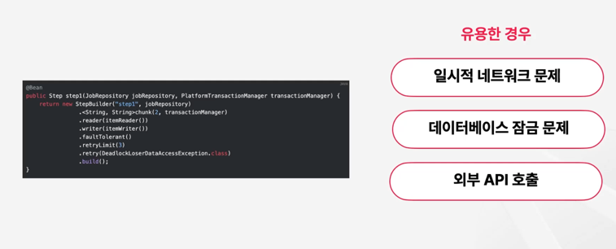

### 이커머스란 무엇인가?

### 이커머스 발전 과정

### 이커머스 플랫폼

### 자사몰 vs 외부몰

차이점

### 자사몰

DtoC 형태 : Direct to Customer  

### 개인/소호 쇼핑몰 제작 솔루션

### 외부몰

### 서비스 중심 이커머스

### 이커머스 비즈니스 모델
  

### 이커머스 트렌드

### TaskletStep

### 예외 처리  

### 예외 처리 - Retry
 

네트워크 연결이 불안정할때 일정시간 후, 재시도 하면 성공 확률이 높다.  
동시성 문제가 발생할 수 있는 상황에서 레코드 잡금과 같은 문제를 재시도를 통해 해결할 수 있습니다.  

