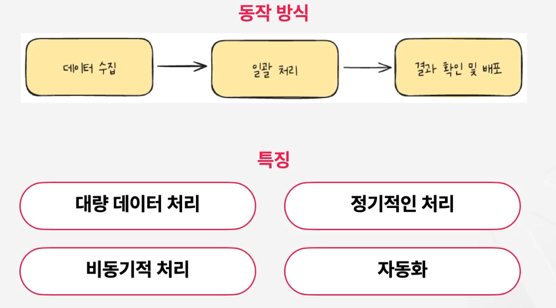
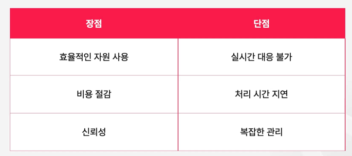
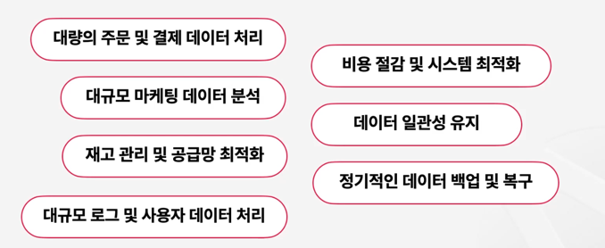
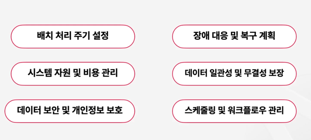

### 이커머스 플랫폼의 배치 처리

배치 처리는 대량의 데이터를 모아서 한꺼번에 처리하는 방식으로 특정 시점에 여러 작업을 묶어 일괄적으로 처리하는 것을 의미합니다.  
실시간 처리가 아닙니다.  

### 배치 처리 장단점

### 배치 처리 기술 스택

### 이커머스에서의 배치 처리 필요성

### 이커머스에서 배치 처리 활용 시 고려사항
