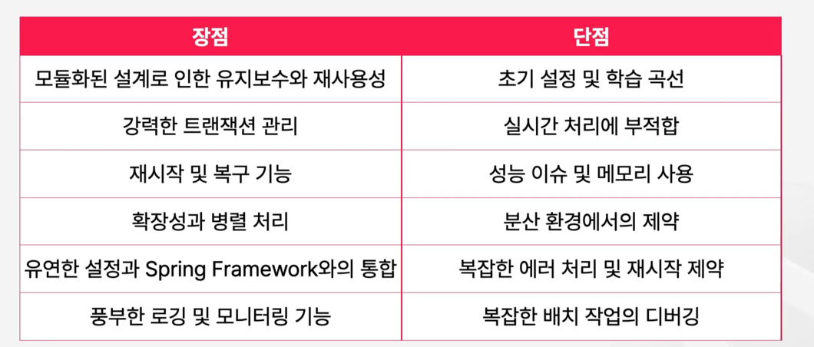

### Spring Batch란?
대량 데이터 처리 및 일괄 처리 작업을 위한 경량화된 프레임워크

### Spring Batch 특징

모듈화된 아키텍처, 유연한 설정, 확장성, 메타데이터 관리  

스프링 배치에서 모든 배치 작업은 잡으로 정의되고 잡은 여러 개의 스텝으로 나뉘어져 있습니다.  

스텝은 개별적인 작업 단위로 데이터의 읽기 처리, 쓰기 등의 역할을 담당합니다.  

### Spring Batch 장단점

