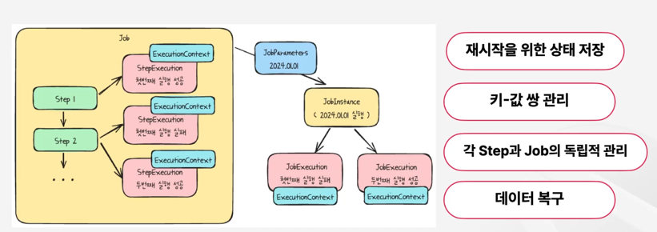
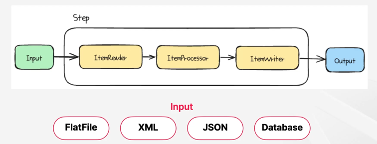

### Spring Batch 주요 구성 요소

### Job

배치 프로세스 캡슐화를 통해 배치 작업의 시작부터 끝까지 모든 단계를 포함하고, 이 단계를 논리적으로 묶어 전체 배치 작업을 정의합니다.  

### JobInstance

잡이 실행될때마다 생성되는 논리적 단위입니다.  
잡 인스턴스는 이전 실행의 상태 정보를 유지합니다.  
이전의 실패한 작업의 상태를 저장하고 실패한 지점부터 다시 시작할 수 있습니다.  

### JobParameters

배치 작업을 시작할때 사용되는 매개변수로 잡 인스턴스를 각각 구분하고, 작업 실행중 참조 데이터로 활용됩니다.  

모든 잡 파라미터가 식별에 기여하는 것은 아닙니다. 

### JobExecution

### Step

### StepExecution

### ExecutionContext

### JobRepository

### JobLauncher

### ItemReader

순방향 읽기만 허용  

### ItemProcessor (Optional)

필터링도 가능합니다. 

### ItemWriter

처리된 데이터를 외부 자원에 기록합니다.  