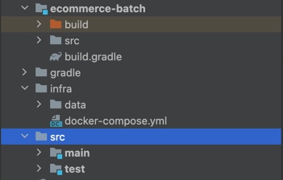
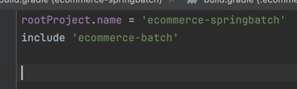
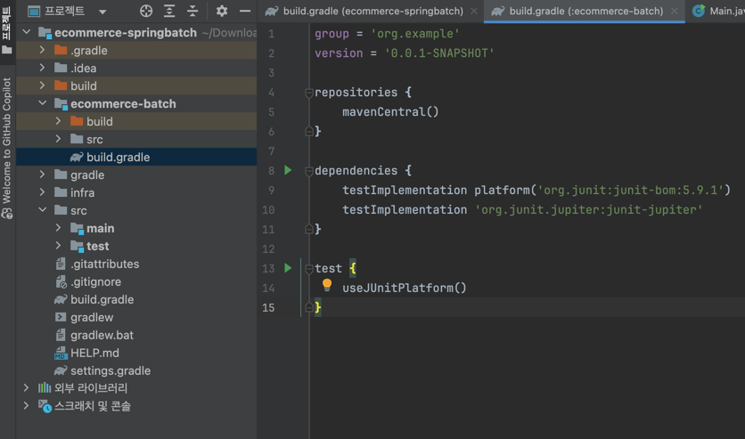

(1) 루트에 있는 폴더는 필요가 없으므로 다 날립니다.  


ecommerce-batch를 멀티 모듈로 만들어 줍니다.  


settings.gradle에 모듈이 추가된 것을 확인할 수 있습니다.  


```java
plugins {
    id 'java'
    id 'org.springframework.boot' version '3.4.2'
    id 'io.spring.dependency-management' version '1.1.7'
}

group = 'com.sangyunpark99'
version = '0.0.1-SNAPSHOT'

allprojects {

}

java {
    toolchain {
        languageVersion = JavaLanguageVersion.of(21)
    }
}

repositories {
    mavenCentral()
}

dependencies {
    implementation 'org.springframework.boot:spring-boot-starter-data-jpa'
    implementation 'com.fasterxml.jackson.core:jackson-core:2.17.2'
    implementation 'com.fasterxml.jackson.core:jackson-databind:2.17.2'
    compileOnly 'org.projectlombok:lombok:1.18.36'
    annotationProcessor 'org.projectlombok:lombok:1.18.36'
    runtimeOnly 'org.postgresql:postgresql'

    testCompileOnly 'org.projectlombok:lombok:1.18.36'
    testAnnotationProcessor 'org.projectlombok:lombok:1.18.36'
    runtimeOnly 'com.h2database:h2'
    testImplementation 'org.springframework.boot:spring-boot-starter-test'
    testRuntimeOnly 'org.junit.platform:junit-platform-launcher'
}
```

모든 프로젝트 반영해주기 위해서
allprojects {

}라는 칸에 

```java
plugins {
    id 'java'
    id 'org.springframework.boot' version '3.4.2'
    id 'io.spring.dependency-management' version '1.1.7'
    }

    allprojects {

        group = 'com.sangyunpark99'
        version = '0.0.1-SNAPSHOT'
    
        java {
            toolchain {
                languageVersion = JavaLanguageVersion.of(21)
            }
        }
    
        repositories {
          mavenCentral()
        }
    
        dependencies {
            implementation 'org.springframework.boot:spring-boot-starter-data-jpa'
            implementation 'com.fasterxml.jackson.core:jackson-core:2.17.2'
            implementation 'com.fasterxml.jackson.core:jackson-databind:2.17.2'
            compileOnly 'org.projectlombok:lombok:1.18.36'
            annotationProcessor 'org.projectlombok:lombok:1.18.36'
            runtimeOnly 'org.postgresql:postgresql'
        
            testCompileOnly 'org.projectlombok:lombok:1.18.36'
            testAnnotationProcessor 'org.projectlombok:lombok:1.18.36'
            runtimeOnly 'com.h2database:h2'
            testImplementation 'org.springframework.boot:spring-boot-starter-test'
            testRuntimeOnly 'org.junit.platform:junit-platform-launcher'
        }

  }
```
이 내용을 넣어줍니다. 

allprojects 블록을 사용하면 멀티 모듈 환경에서 모든 서브모듈(subprojects)에 공통으로 적용되는 설정을 정의할 수 있습니다.
즉, 루트 프로젝트 + 모든 서브모듈에 해당 설정이 적용됩니다.

추가로
```java
apply plugins: 'java-library'
    apply plugins: 'org.springframework.boot'
    apply plugin: 'io.spring.dependency-management'
```

📌 플러그인 명시하는 이유  
Gradle 빌드 과정에서 특정 기능을 사용하기 위해 필요함  

예를 들어, java-library 플러그인은 Java 프로젝트로 인식하고 빌드할 수 있도록 해줍니다.
org.springframework.boot는 Spring Boot 애플리케이션을 실행 가능하도록 만듭니다.
io.spring.dependency-management는 Spring 의존성 관리를 쉽게 하도록 지원합니다.

플러그인을 적용하지 않으면 Gradle이 해당 기능을 인식하지 못하고 **빌드가 실패**합니다.
각 플러그인을 제거하면 발생하는 오류를 확인해보겠습니다.

ecommerce-batch 모듈에서는 plugin을 제거해 줍니다.


ecommerce-batch 모듈은 별도의 자르로 실행이 되어야 하기 때문에
```java
bootJar {
    enabled = false
}

jar {
    enabled = true
}

dependencies {
    testImplementation platform('org.junit:junit-bom:5.9.1')
    testImplementation 'org.junit.jupiter:junit-jupiter'
}

test {
    useJUnitPlatform()
}
```
bootJar를 false로 지정해주고, jar를 enable 해줍니다.

```java
bootJar {
    enabled = false
}

jar {
    enabled = true
}

dependencies {
    
}

test {
    useJUnitPlatform()
}
```
dpendencies에는 spring-batch관련된 의존성을 추가해줍니다.  
```java
dependencies {
    implementation 'org.springframework.boot:spring-boot-starter-batch'
    testImplementation 'org.springframework.batch:spring-batch-test'
}
```
