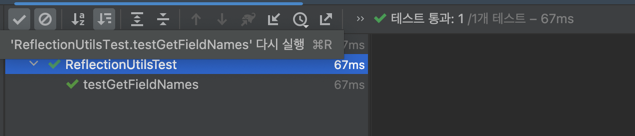
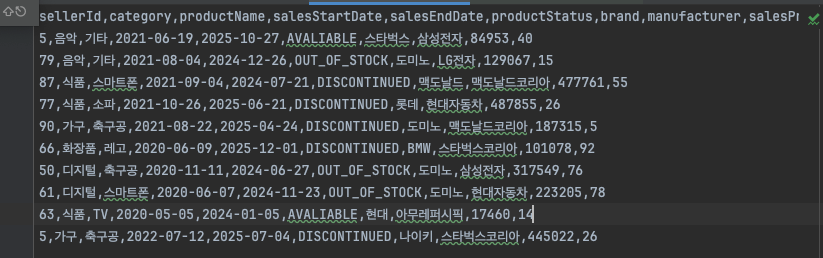
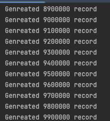
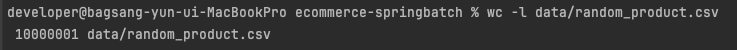

상품 도메인 클래스를 만들어줍니다.  
```java
package org.example.batch.domain.product;

import java.time.LocalDate;
import java.time.LocalDateTime;
import lombok.AccessLevel;
import lombok.AllArgsConstructor;
import lombok.Data;
import lombok.NoArgsConstructor;

@Data
@NoArgsConstructor(access = AccessLevel.PROTECTED)
@AllArgsConstructor(access = AccessLevel.PRIVATE) // 정적 생성자만 사용하도록 세팅
public class Product {

  private String productId;
  private Long sellerId;

  private String category;
  private String productName;
  private LocalDate salesStartDate;
  private LocalDate salesEndDate;
  private ProductStatus productStatus;
  private String brand;
  private String manufacturer;

  private int salesPrice;
  private int stockQuantity;
  private LocalDateTime createdAt;
  private LocalDateTime updatedAt;
}
```

ProductStatus는 enum클래스로 만들어줍니다.
```java
package org.example.batch.domain.product;

public enum ProductStatus {

  AVALIABLE("판매 중"),
  OUT_OF_STOCK("품절"),
  DISCONTINUED("판매 종료");

  final String desc;

  ProductStatus(String desc) {
    this.desc = desc;
  }
}
```

sql 스키마를 사용해 상품 도메인 테이블을 만들어줍니다.
```sql
create table products
(
    product_id       varchar(255) primary key,
    seller_id        bigint       not null,
    category         varchar(255) not null,
    product_name     varchar(255) not null,
    sales_start_date date,
    sales_end_date   date,
    product_status   varchar(50),
    brand            varchar(255),
    manufacturer     varchar(255),
    sales_price      integer      not null,
    stock_quantity   integer   default 0,
    created_at       timestamp default current_timestamp,
    updated_at       timestamp default current_timestamp
);

create index idx_products_product_status on products (product_status);
create index idx_products_category on products (category);
create index idx_products_brand on products (brand);
create index idx_products_manufacturer on products (manufacturer);
create index idx_products_seller_id on products (seller_id);
```
상품 상태, 카테고리, 브랜드, 제조업회사, 판매자 아이디, 브랜드의 조회를 최적화하기 위해서 인덱스도 만듭니다.  


CSV 파일을 편하게 만들어주는 라이브러리를 implement해줍니다.  
apache CSV  
```java
bootJar {
    enabled = false
}

jar {
    enabled = true
}

dependencies {
    implementation 'org.springframework.boot:spring-boot-starter-batch'
    implementation 'org.apache.commons:commons-csv:1.13.0'

    testImplementation 'org.springframework.batch:spring-batch-test'
}

test {
    useJUnitPlatform()
}
```
gradle에 추가해준 뒤, refresh 해줍니다.  


util 패키지를 만들어서, ProductGenerator 클래스를 만들어 줍니다.  
강사님은 원래 이런 작업들은 파이썬을 많이 사용함. 

```java
package org.example.batch.util;

import java.io.FileWriter;
import java.io.IOException;
import org.apache.commons.csv.CSVFormat;
import org.apache.commons.csv.CSVPrinter;
import org.example.batch.domain.product.Product;

public class ProductGenerator {

  public static void main(String[] args) {
    String csvFilePath = "data/random_product.csv";
    int record = 10_000_000;

    try (
        FileWriter fileWriter = new FileWriter(csvFilePath);
        CSVPrinter csvPrinter = new CSVPrinter(fileWriter, CSVFormat.DEFAULT
            .builder()
            .setHeader(ReflectionUtils.getFieldNames(Product.class).toArray(String[]::new))
            .build()
        )
    ) {

    } catch (IOException e) {
      throw new RuntimeException(e);
    }
  }
}

```

랜덤으로 CSV파일을 만들어주는데, 일일히 필드 변수를 입력하는게 귀찮아서 or 확장성이 별로 안좋아서 Reflection을 활용해서 만들어 줍니다.  

```java
package org.example.batch.util;

import static java.lang.reflect.Modifier.isStatic;

import java.lang.reflect.Field;
import java.util.ArrayList;
import java.util.List;

public class ReflectionUtils {

  public static List<String> getFieldNames(Class<?> clazz) {
    List<String> fieldNames = new ArrayList<>();
    Field[] fields = clazz.getDeclaredFields();

    for (Field field : fields) {
      if (!isStatic(field.getModifiers())) {
        fieldNames.add(field.getName());
      }
    }

    return fieldNames;
  }
}
```
이런식으로 Reflection을 활용하면, 필드 변수의 이름을 가져올 수 있습니다.  
```java
if (!isStatic(field.getModifiers())) {
```
이 조건문을 사용해서 static한 필드 변수는 빼주도록 합니다.

csv를 만들때, id나 생성날짜 그리고 업데이트 날짜는 필요하지 않는다.  
따로 dto 객체를 만들어서 사용해줍니다.  
```java
package org.example.batch.dto;

import java.time.LocalDate;
import java.time.LocalDateTime;
import lombok.AccessLevel;
import lombok.AllArgsConstructor;
import lombok.Getter;
import lombok.NoArgsConstructor;
import lombok.Setter;
import org.example.batch.domain.product.ProductStatus;

@Getter
@Setter
@NoArgsConstructor
@AllArgsConstructor(access = AccessLevel.PRIVATE)
public class ProductUploadCsvRow {

  private Long sellerId;

  private String category;
  private String productName;
  private LocalDate salesStartDate;
  private LocalDate salesEndDate;
  private ProductStatus productStatus;
  private String brand;
  private String manufacturer;

  private int salesPrice;
  private int stockQuantity;
  private LocalDateTime createdAt;
  private LocalDateTime updatedAt;
}
```
CSV row 파일을 읽었을때 ProductStatus가 enum인지 아닌지 따로 구분해줄 필요가 없도록 하기 위해
ProductStatus와 나머지를 전부 String으로 변환해줍니다.  

```java
package org.example.batch.dto;

import lombok.AccessLevel;
import lombok.AllArgsConstructor;
import lombok.Getter;
import lombok.NoArgsConstructor;
import lombok.Setter;

@Getter
@Setter
@NoArgsConstructor
@AllArgsConstructor(access = AccessLevel.PRIVATE)
public class ProductUploadCsvRow {

  private Long sellerId;

  private String category;
  private String productName;
  private String salesStartDate;
  private String salesEndDate;
  private String productStatus;
  private String brand;
  private String manufacturer;

  private int salesPrice;
  private int stockQuantity;
}
```

```java
package org.example.batch.util;

import java.io.FileWriter;
import java.io.IOException;
import org.apache.commons.csv.CSVFormat;
import org.apache.commons.csv.CSVPrinter;
import org.example.batch.dto.ProductUploadCsvRow;

public class ProductGenerator {

  public static void main(String[] args) {
    String csvFilePath = "data/random_product.csv";
    int record = 10_000_000;

    try (
        FileWriter fileWriter = new FileWriter(csvFilePath);
        CSVPrinter csvPrinter = new CSVPrinter(fileWriter, CSVFormat.DEFAULT
            .builder()
            .setHeader(
                ReflectionUtils.getFieldNames(ProductUploadCsvRow.class).toArray(String[]::new))
            .build()
        )
    ) {

    } catch (IOException e) {
      throw new RuntimeException(e);
    }
  }
}
```
만드러준 ProductUploadCsvRow를 넣어줍니다.  


ReflectUtils에 대한 기능이 제대로 됬는지 확인하기 위해, 테스트 코드를 짜줍니다.  
테스트 코드는 아래와 같습니다.  
```java
package org.example.batch.util;

import static org.assertj.core.api.Assertions.assertThat;

import java.util.List;
import org.junit.jupiter.api.Test;

class ReflectionUtilsTest {

  private static class TestClass {

    private String stringField;
    private int intField;
    public static final String CONSTANT = "constant";
  }

  @Test
  void testGetFieldNames() {
    List<String> fieldNames = ReflectionUtils.getFieldNames(TestClass.class);

    assertThat(fieldNames).hasSize(2)
        .containsExactly("stringField", "intField")
        .doesNotContain("CONSTANT");
  }
}
```


테스트가 통과했습니다. 이로써 static 변수는 걸러주는 것이 증명되었습니다. 

```java
package org.example.batch.util;

import java.io.FileWriter;
import java.io.IOException;
import java.time.LocalDate;
import java.util.Arrays;
import java.util.Random;
import org.apache.commons.csv.CSVFormat;
import org.apache.commons.csv.CSVPrinter;
import org.example.batch.domain.product.ProductStatus;
import org.example.batch.dto.ProductUploadCsvRow;

public class ProductGenerator {

  private static final Random RANDOM = new Random();

  public static void main(String[] args) {
    String csvFilePath = "data/random_product.csv";
    int recordCnt = 10;

    try (
        FileWriter fileWriter = new FileWriter(csvFilePath);
        CSVPrinter csvPrinter = new CSVPrinter(fileWriter, CSVFormat.DEFAULT
            .builder()
            .setHeader(
                ReflectionUtils.getFieldNames(ProductUploadCsvRow.class).toArray(String[]::new))
            .build()
        )
    ) {
      for (int i = 0; i < recordCnt; i++) {
        csvPrinter.printRecord(generateRecord());
        if (i % 100_000 == 0) {
          System.out.println("Genreated " + i + " record");
        }
      }
    } catch (IOException e) {
      throw new RuntimeException(e);
    }
  }

  private static Object[] generateRecord() {
    ProductUploadCsvRow row = randomProductRow();
    return new Object[]{
        row.getSellerId(),
        row.getCategory(),
        row.getProductName(),
        row.getSalesStartDate(),
        row.getSalesEndDate(),
        row.getProductStatus(),
        row.getBrand(),
        row.getManufacturer(),
        row.getSalesPrice(),
        row.getStockQuantity()
    };
  }

  private static ProductUploadCsvRow randomProductRow() {
    String[] CATEGORIES = {"가전", "가구", "패션", "식품", "화장품", "서적", "스포츠", "완구", "음악", "디지털"};
    String[] PRODUCT_NAMES = {"TV", "소파", "셔츠", "햇반", "스킨케어 세트", "소설", "축구공", "레고", "기타", "스마트폰"};
    String[] BRANDS = {"삼성", "LG", "나이키", "아무레퍼시픽", "현대", "BMW", "롯데", "스타벅스", "도미노", "맥도날드"};
    String[] MANUFACTURES = {"삼성전자", "LG전자", "나이키코리아", "아무레퍼시픽", "현대자동차", "BMW코리아", "롯데제과",
        "스타벅스코리아", "도미노피자", "맥도날드코리아"};
    String[] STATUSES = Arrays.stream(ProductStatus.values()).map(Enum::name)
        .toArray(String[]::new);

    return ProductUploadCsvRow.of(
        randomSellerId(),
        randomChoice(CATEGORIES),
        randomChoice(PRODUCT_NAMES),
        randomDate(2020, 2023),
        randomDate(2024, 2026),
        randomChoice(STATUSES),
        randomChoice(BRANDS),
        randomChoice(MANUFACTURES),
        randomSalesPrice(),
        randomStockQuantity()
    );
  }

  private static int randomStockQuantity() {
    return RANDOM.nextInt(1, 100);
  }

  private static int randomSalesPrice() {
    return RANDOM.nextInt(10_000, 500_000);
  }

  private static String randomDate(int startYear, int endYear) {
    int year = RANDOM.nextInt(startYear, endYear);
    int month = RANDOM.nextInt(1, 13);
    int day = RANDOM.nextInt(1, 29);
    return LocalDate.of(year, month, day).toString(); // yyyy-mm-dd;
  }

  private static String randomChoice(String[] array) {
    return array[RANDOM.nextInt(array.length)];
  }

  private static Long randomSellerId() {
    return RANDOM.nextLong(1, 101);
  }
}

```
깔끔하게 제너레이터를 만들어 주었습니다.  
이제 만들어준 제너레이터를 돌리게 되면,


이러한 csv파일이 만들어지게 됩니다.  

```java
  public static void main(String[] args) {
    String csvFilePath = "data/random_product.csv";
    int recordCnt = 10_000_000;
```

1000만개를 만듭니다.  


1000만개의 데이터가 만들어졌는지 확인하기 위해서, 줄의 갯수를 확인합니다.  
