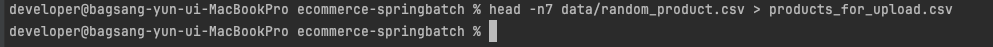
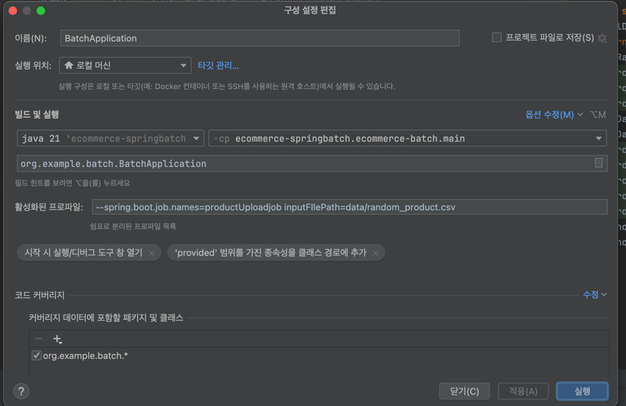

CSV 파일의 데이터를 Spring Batch를 사용해서 로컬에 세팅해 주었던 postSQL DB로 저장시키는 작업을 진행합니다.  

application.yml 설정을 해줍니다.
```java
spring:
  application:
    name: ecommerce-batch

  datasource:
    url: jdbc:postgresql://localhost:5433/postgres?profileSQL=true
    username: postgres
    password: localpw
    hikari:
      maximum-pool-size: 200
  batch:
    jdbc:
      initialize-schema: always
logging:
  level:
    root: INFO
    org.springframework.jdbc.core.JdbcTemplate: DEBUG
    org.springframework.jdbc.core.StatementCreatorUtils: DEBUG
```

Batch Job을 위한 클래스를 하나 만들어 줍니다.  

만들어야 하는 빈 : 잡, 스텝, 아이템리더, 프로세서, 라이터 빈들을 만들어야 합니다.
config 파일에 빈을 여러개를 같이 만들어주는 방식으로 합니다.  


테스트 코드 용 CSV 파일 데이터를 따로 만들어 줍니다. 
Batch 전용 테스트 코드는 아래와 같습니다.  
```java
package org.example.batch.jobconfig.product.upload;

import static org.assertj.core.api.Assertions.assertThat;
import static org.junit.jupiter.api.Assertions.assertAll;
import static org.junit.jupiter.api.Assertions.assertEquals;

import java.io.IOException;
import javax.sql.DataSource;
import org.example.batch.BatchApplication;
import org.example.batch.service.product.ProductService;
import org.junit.jupiter.api.Test;
import org.springframework.batch.core.Job;
import org.springframework.batch.core.JobExecution;
import org.springframework.batch.core.JobParameter;
import org.springframework.batch.core.JobParameters;
import org.springframework.batch.core.JobParametersBuilder;
import org.springframework.batch.test.JobLauncherTestUtils;
import org.springframework.batch.test.context.SpringBatchTest;
import org.springframework.beans.factory.annotation.Autowired;
import org.springframework.beans.factory.annotation.Value;
import org.springframework.context.annotation.Bean;
import org.springframework.context.annotation.Configuration;
import org.springframework.core.io.Resource;
import org.springframework.jdbc.core.JdbcTemplate;
import org.springframework.test.context.TestPropertySource;
import org.springframework.test.context.jdbc.Sql;
import org.springframework.test.context.junit.jupiter.SpringJUnitConfig;

@Sql("/sql/schema.sql")
@SpringBatchTest
@SpringJUnitConfig(classes = {BatchApplication.class})
@TestPropertySource(properties = {"spring.batch.job.name=productUploadJob"})
class ProductUploadJobConfigurationTest {

  @Configuration
  class testConfig {

    @Bean
    public JobLauncherTestUtils jobLauncherTestUtils() {
      return new JobLauncherTestUtils();
    }
  }

  @Autowired
  private JobLauncherTestUtils jobLauncherTestUtils;

  private JdbcTemplate jdbcTemplate;

  @Autowired
  public void setDataSource(DataSource dataSource) {
    jdbcTemplate = new JdbcTemplate(dataSource);
  }

  @Value("classpath:/data/products_for_upload.csv")
  private Resource input;

  @Autowired
  private ProductService productService;

  @Test
  void testJob(@Autowired Job productUploadJob) throws Exception {
    JobParameters jobParameter = jobParameters();
    jobLauncherTestUtils.setJob(productUploadJob);

    JobExecution jobExecution = jobLauncherTestUtils.launchJob(jobParameter);

    assertAll(
        () -> assertThat(productService.countProduct()).isEqualTo(56),
        () -> assertEquals("COMPLETED", jobExecution.getExitStatus().getExitCode())
    );
  }

  private JobParameters jobParameters() throws IOException {
    return new JobParametersBuilder()
        .addJobParameter("inputFilePath",
            new JobParameter<>(input.getFile().getAbsolutePath(), String.class, false))
        .toJobParameters();
  }
}
```

csv파일에 존재하는 데이터가 postgresql DB에 잘 들어갔는지 갯수를 확인해주는 Service 코드를 만들어줍니다.
```java
package org.example.batch.service.product;

import lombok.RequiredArgsConstructor;
import org.springframework.jdbc.core.JdbcTemplate;
import org.springframework.stereotype.Service;

@Service
@RequiredArgsConstructor
public class ProductService {

  private final JdbcTemplate jdbcTemplate;

  public Long countProduct() {
    return jdbcTemplate.queryForObject("select count(*) from products", Long.class);
  }
}
```

테스트 코드에서 중복으로 사용되는 부분은 따로 분리한 뒤, 상속받아 테스트 코드를 구현합니다.  
테스트 코드를 리팩토링 해줍니다.  
```java
package org.example.batch;

import javax.sql.DataSource;
import org.springframework.batch.test.JobLauncherTestUtils;
import org.springframework.batch.test.context.SpringBatchTest;
import org.springframework.beans.factory.annotation.Autowired;
import org.springframework.context.annotation.Bean;
import org.springframework.context.annotation.Configuration;
import org.springframework.jdbc.core.JdbcTemplate;
import org.springframework.test.context.jdbc.Sql;
import org.springframework.test.context.junit.jupiter.SpringJUnitConfig;

@Sql("/sql/schema.sql")
@SpringBatchTest
@SpringJUnitConfig(classes = {BatchApplication.class})
public abstract class BaseBatchIntegrationTest {

  @Configuration
  class testConfig {

    @Bean
    public JobLauncherTestUtils jobLauncherTestUtils() {
      return new JobLauncherTestUtils();
    }
  }

  @Autowired
  protected JobLauncherTestUtils jobLauncherTestUtils;

  protected JdbcTemplate jdbcTemplate;

  @Autowired
  public void setDataSource(DataSource dataSource) {
    jdbcTemplate = new JdbcTemplate(dataSource);
  }
}
```
실행을 방지하기 위해서 추상 클래스로 사용해줍니다.  


```java
package org.example.batch.jobconfig.product.upload;

import static org.assertj.core.api.Assertions.assertThat;
import static org.junit.jupiter.api.Assertions.assertAll;
import static org.junit.jupiter.api.Assertions.assertEquals;

import java.io.IOException;
import org.example.batch.BatchApplication;
import org.example.batch.service.product.ProductService;
import org.junit.jupiter.api.Test;
import org.springframework.batch.core.Job;
import org.springframework.batch.core.JobExecution;
import org.springframework.batch.core.JobParameter;
import org.springframework.batch.core.JobParameters;
import org.springframework.batch.core.JobParametersBuilder;
import org.springframework.batch.test.context.SpringBatchTest;
import org.springframework.beans.factory.annotation.Autowired;
import org.springframework.beans.factory.annotation.Value;
import org.springframework.core.io.Resource;
import org.springframework.test.context.TestPropertySource;
import org.springframework.test.context.jdbc.Sql;
import org.springframework.test.context.junit.jupiter.SpringJUnitConfig;

@Sql("/sql/schema.sql")
@SpringBatchTest
@SpringJUnitConfig(classes = {BatchApplication.class})
@TestPropertySource(properties = {"spring.batch.job.name=productUploadJob"})
class ProductUploadJobConfigurationTest extends BaseBatchIntegrationTest {

  @Value("classpath:/data/products_for_upload.csv")
  private Resource input;

  @Autowired
  private ProductService productService;

  @Test
  void testJob(@Autowired Job productUploadJob) throws Exception {
    JobParameters jobParameter = jobParameters();
    jobLauncherTestUtils.setJob(productUploadJob);

    JobExecution jobExecution = jobLauncherTestUtils.launchJob(jobParameter);

    assertAll(
        () -> assertThat(productService.countProduct()).isEqualTo(56),
        () -> assertEquals("COMPLETED", jobExecution.getExitStatus().getExitCode())
    );
  }

  private JobParameters jobParameters() throws IOException {
    return new JobParametersBuilder()
        .addJobParameter("inputFilePath",
            new JobParameter<>(input.getFile().getAbsolutePath(), String.class, false))
        .toJobParameters();
  }
}
```
Job이 완료됬는지 확인하는 메서드는 따로 메서드로 정의해놓은 뒤 빼놓습니다.
```java
package org.example.batch;

import static org.junit.jupiter.api.Assertions.assertEquals;

import javax.sql.DataSource;
import org.springframework.batch.core.JobExecution;
import org.springframework.batch.test.JobLauncherTestUtils;
import org.springframework.batch.test.context.SpringBatchTest;
import org.springframework.beans.factory.annotation.Autowired;
import org.springframework.context.annotation.Bean;
import org.springframework.context.annotation.Configuration;
import org.springframework.jdbc.core.JdbcTemplate;
import org.springframework.test.context.jdbc.Sql;
import org.springframework.test.context.junit.jupiter.SpringJUnitConfig;

@Sql("/sql/schema.sql")
@SpringBatchTest
@SpringJUnitConfig(classes = {BatchApplication.class})
public abstract class BaseBatchIntegrationTest {

  @Configuration
  class testConfig {

    @Bean
    public JobLauncherTestUtils jobLauncherTestUtils() {
      return new JobLauncherTestUtils();
    }
  }

  @Autowired
  protected JobLauncherTestUtils jobLauncherTestUtils;

  protected JdbcTemplate jdbcTemplate;

  @Autowired
  public void setDataSource(DataSource dataSource) {
    jdbcTemplate = new JdbcTemplate(dataSource);
  }

  public static void assertJobCompleted(JobExecution jobExecution) {
    assertEquals("COMPLETED", jobExecution.getExitStatus().getExitCode());
  }
}

```

static 메서드이므로 아래와 같이 사용이 가능합니다.  
```java
@Test
  void testJob(@Autowired Job productUploadJob) throws Exception {
    JobParameters jobParameter = jobParameters();
    jobLauncherTestUtils.setJob(productUploadJob);

    JobExecution jobExecution = jobLauncherTestUtils.launchJob(jobParameter);

    assertAll(
        () -> assertThat(productService.countProduct()).isEqualTo(56),
        () -> assertJobCompleted(jobExecution)
    );
  }
```

BatchStepExecutionListener를 정의해줍니다.
```java
package org.example.batch.service.monitoring;

import lombok.RequiredArgsConstructor;
import lombok.extern.slf4j.Slf4j;
import org.springframework.batch.core.ExitStatus;
import org.springframework.batch.core.StepExecution;
import org.springframework.batch.core.StepExecutionListener;
import org.springframework.stereotype.Component;

@Slf4j
@Component
@RequiredArgsConstructor
public class BatchStepExecutionListener implements StepExecutionListener {

  @Override
  public ExitStatus afterStep(StepExecution stepExecution) {
    log.info("after step - execution context: {}", stepExecution.getExecutionContext());
    return ExitStatus.COMPLETED;
  }
}
```


Profile을 따로 정의해줍니다.  

Spring Batch를 사용할 때 기본적인 Job → Step → Reader → Processor → Writer 구조를 갖추는 것이 일반적이지만, 모든 과정이 필수는 아니지만, 프로젝트의 요구사항에 따라 단순화할 수도 있습니다.  

```java
package org.example.batch.jobconfig.product.upload;

import javax.sql.DataSource;
import org.example.batch.domain.product.Product;
import org.example.batch.dto.ProductUploadCsvRow;
import org.example.batch.service.monitoring.BatchStepExecutionListener;
import org.example.batch.util.ReflectionUtils;
import org.springframework.batch.core.Job;
import org.springframework.batch.core.JobExecutionListener;
import org.springframework.batch.core.Step;
import org.springframework.batch.core.configuration.annotation.StepScope;
import org.springframework.batch.core.job.builder.JobBuilder;
import org.springframework.batch.core.repository.JobRepository;
import org.springframework.batch.core.step.builder.StepBuilder;
import org.springframework.batch.item.ItemProcessor;
import org.springframework.batch.item.ItemReader;
import org.springframework.batch.item.ItemWriter;
import org.springframework.batch.item.database.JdbcBatchItemWriter;
import org.springframework.batch.item.database.builder.JdbcBatchItemWriterBuilder;
import org.springframework.batch.item.file.FlatFileItemReader;
import org.springframework.batch.item.file.builder.FlatFileItemReaderBuilder;
import org.springframework.beans.factory.annotation.Value;
import org.springframework.context.annotation.Bean;
import org.springframework.context.annotation.Configuration;
import org.springframework.core.io.FileSystemResource;
import org.springframework.transaction.PlatformTransactionManager;

@Configuration
public class ProductUploadJobConfiguration {

  @Bean
  public Job productUploadJob(JobRepository jobRepository,
      Step productUploadStep,
      JobExecutionListener listener) {
    return new JobBuilder("productUploadJob", jobRepository)
        .listener(listener)
        .start(productUploadStep)
        .build();
  }

  @Bean
  public Step productUploadStep(JobRepository jobRepository,
      PlatformTransactionManager transactionManager,
      BatchStepExecutionListener batchStepExecutionListener,
      ItemReader<ProductUploadCsvRow> productReader,
      ItemProcessor<ProductUploadCsvRow, Product> productProcessor,
      ItemWriter<Product> productWriter
  ) {
    return new StepBuilder("productUploadStep", jobRepository)
        .<ProductUploadCsvRow, Product>chunk(1000, transactionManager)
        .reader(productReader)
        .processor(productProcessor)
        .writer(productWriter)
        .allowStartIfComplete(true) // 개발 단계에서는 true를 넣어서 돌립니다.
        .listener(batchStepExecutionListener)
        .build();
  }

  // csv파일 읽기
  @Bean
  @StepScope
  public FlatFileItemReader<ProductUploadCsvRow> productReader(
      @Value("#{jobParameters['inputFilePath']}") String path
  ) {
    return new FlatFileItemReaderBuilder<ProductUploadCsvRow>()
        .name("productReader")
        .resource(new FileSystemResource(path))
        .delimited()
        .names(ReflectionUtils.getFieldNames(ProductUploadCsvRow.class).toArray(String[]::new))
        .targetType(ProductUploadCsvRow.class)
        .linesToSkip(1)
        .build();
  }

  // productUploadCsvRow -> Product로 매핑
  @Bean
  public ItemProcessor<ProductUploadCsvRow, Product> productProcessor() {
    return row -> Product.from(row);
  }

  @Bean
  public JdbcBatchItemWriter<Product> productWriter(DataSource dataSource) {

    String sql = "insert into products(product_id, seller_id, category, product_name, "
        + "sales_start_date, sales_end_date, product_status, "
        + "brand, manufacturer, sales_price, stock_quantity, created_at, updated_at)"
        + " values(:productId, :sellerId, :category, :productName, :salesStartDate, "
        + ":salesEndDate, :productStatus, :brand, :manufacturer, :salesPrice, "
        + ":stockQuantity, :createdAt, :updatedAt)";

    return new JdbcBatchItemWriterBuilder<Product>()
        .dataSource(dataSource)
        .sql(sql)
        .beanMapped()
        .build();
  }
}
```
1000개의 청크로 나눠서 저장해줍니다.  

