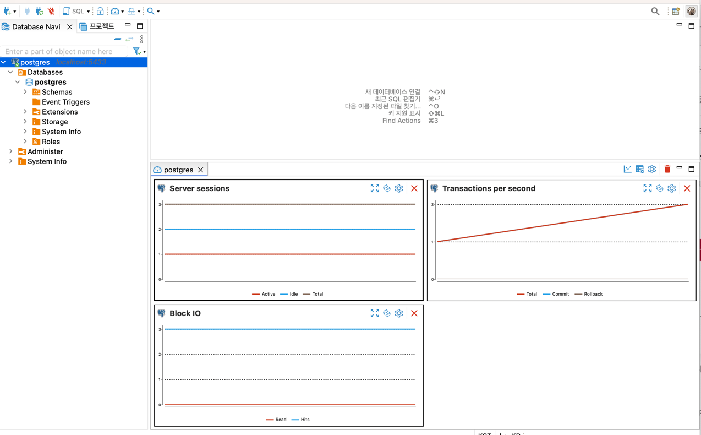
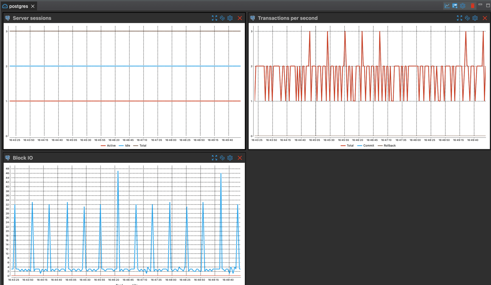
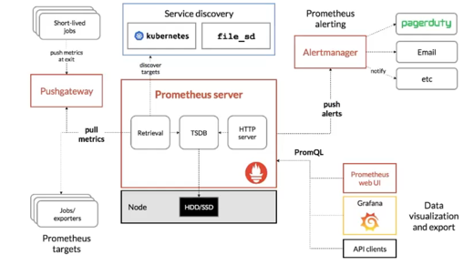
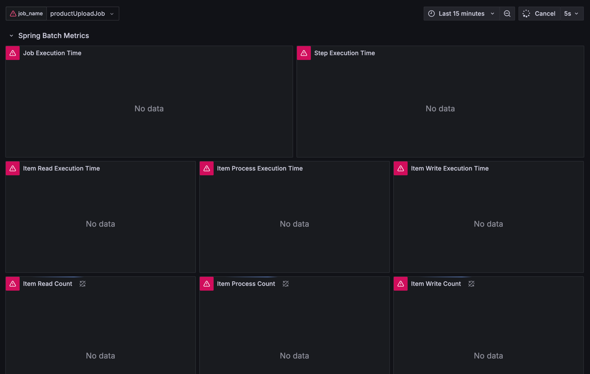
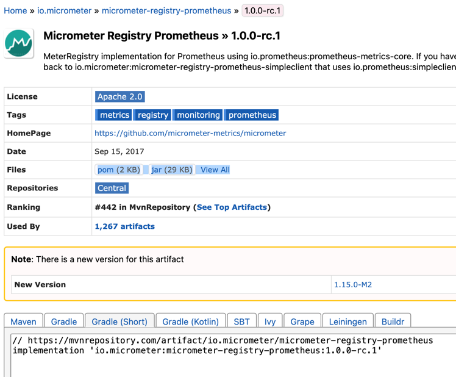
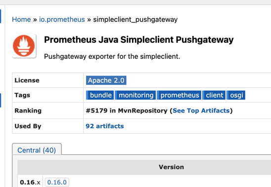
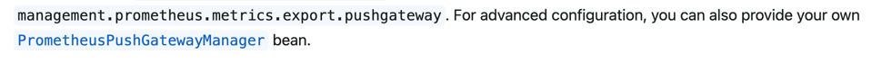
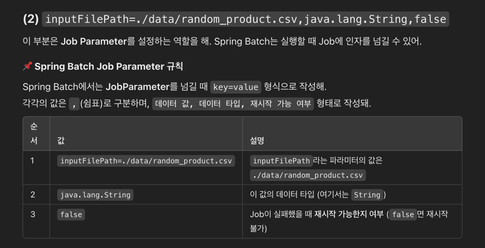

### DB 모니터링
DBeaver로 모니터링을 해줍니다.  


Servicer Session
서버 세션의 의미는 현재 데이터베이스에서 연결된 클라이언트 수를 보여줍니다.  

Active : 실질적으로 네트워크 통신이 진행되고 있는 connection
Idle : 네트워크 통신이 없는 connection 통신을 대기중인 connection


Transaction Per Second
초당 트랜잭션 수를 의미합니다.  

Block IO
read : 실제로 데이터를 읽어오는 블록의 수
hit : 요청된 데이터 블록이 이미 버퍼 캐시에 존재해서 디스크에 접근하지 않고, 메모리에서 직접 제공된 경우



#Prometheus


기본적으로 프로메테우스는 익스포터라는 것을 통해서 매트릭을 주기적으로 댕겨오는 풀 매트릭 방식을 사용합니다.

### Grafana
다양한 데이터 소스를 시각화할 수 있는 대시보드 입니다.  
프로메테우스에서 수집된 데이터도 시작적으로 잘 표현해 줍니다.  

docker-compose로 prometheus와 grafana를 실행합니다.  

아래와 같이 docker-compose를 설정해줍니다.
pushgateway는 prometheus에서 데이터를 수집하는 역할을 합니다.
```yaml
services:
  postgresql:
    image:
      postgres:latest
    restart: always
    volumes: # PostgreSql 컨테이너에서 데이터를 로컬 파일 시스템에 저장하여 컨테이너 삭제 후에도 데이터 유지
      - ./data/ecommerce-db:/var/lib/postgresql/data
    ports:
      - "5433:5432"
    shm_size: 128mb
    environment:
      POSTGRES_PASSWORD: localpw

  prometheus:
    image: prom/prometheus:latest
    restart: always
    volumes:
      - ./prometheus.yml:/etc/prometheus/prometheus.yml
    ports:
      - "9090:9090"

  pushgateway:
    image: prom/pushgateway:latest
    restart: always
    ports:
      - "9091:9091"

  grafana:
    image: grafana/grafana:latest
    restart: always
    ports:
      - "3000:3000"
```

주어진 JSON파일을 사용해서 grafana에 JSON을 넣어줍니다. 
```java
{
  "annotations": {
    "list": [
      {
        "builtIn": 1,
        "datasource": "-- Grafana --",
        "enable": true,
        "hide": true,
        "iconColor": "rgba(0, 211, 255, 1)",
        "limit": 100,
        "name": "Annotations & Alerts",
        "showIn": 0,
        "type": "dashboard"
      }
    ]
  },
  "description": "Dashboard for Spring Batch applications instrumented with Micrometer",
  "editable": true,
  "gnetId": 4701,
  "graphTooltip": 1,
  "id": 1,
  "iteration": 1727106676361,
  "links": [],
  "panels": [
    {
      "collapsed": false,
      "gridPos": {
        "h": 1,
        "w": 24,
        "x": 0,
        "y": 0
      },
      "id": 132,
      "panels": [],
      "repeat": null,
      "title": "Spring Batch Metrics",
      "type": "row"
    },
    {
      "aliasColors": {},
      "bars": false,
      "dashLength": 10,
      "dashes": false,
      "datasource": "Prometheus",
      "editable": true,
      "error": false,
      "fill": 1,
      "grid": {
        "leftLogBase": 1,
        "leftMax": null,
        "leftMin": null,
        "rightLogBase": 1,
        "rightMax": null,
        "rightMin": null
      },
      "gridPos": {
        "h": 7,
        "w": 12,
        "x": 0,
        "y": 1
      },
      "id": 38,
      "legend": {
        "avg": false,
        "current": false,
        "max": false,
        "min": false,
        "show": true,
        "total": false,
        "values": false
      },
      "lines": true,
      "linewidth": 1,
      "links": [],
      "nullPointMode": "null",
      "paceLength": 10,
      "percentage": false,
      "pointradius": 5,
      "points": false,
      "renderer": "flot",
      "seriesOverrides": [],
      "spaceLength": 10,
      "stack": false,
      "steppedLine": false,
      "targets": [
        {
          "expr": "spring_batch_job_seconds_max{job_name=\"$job_name\"}",
          "format": "time_series",
          "hide": false,
          "interval": "",
          "intervalFactor": 2,
          "legendFormat": "{{ job_name }}",
          "metric": "",
          "refId": "A",
          "step": 1200
        }
      ],
      "thresholds": [],
      "timeFrom": null,
      "timeRegions": [],
      "timeShift": null,
      "title": "Job Execution Time",
      "tooltip": {
        "msResolution": false,
        "shared": true,
        "sort": 0,
        "value_type": "cumulative"
      },
      "type": "graph",
      "x-axis": true,
      "xaxis": {
        "buckets": null,
        "mode": "time",
        "name": null,
        "show": true,
        "values": []
      },
      "y-axis": true,
      "y_formats": [
        "ops",
        "short"
      ],
      "yaxes": [
        {
          "decimals": null,
          "format": "ms",
          "label": "",
          "logBase": 1,
          "max": null,
          "min": null,
          "show": true
        },
        {
          "format": "short",
          "label": null,
          "logBase": 1,
          "max": null,
          "min": null,
          "show": true
        }
      ],
      "yaxis": {
        "align": false,
        "alignLevel": null
      }
    },
    {
      "aliasColors": {},
      "bars": false,
      "dashLength": 10,
      "dashes": false,
      "datasource": "Prometheus",
      "fill": 1,
      "gridPos": {
        "h": 7,
        "w": 12,
        "x": 12,
        "y": 1
      },
      "id": 138,
      "legend": {
        "avg": false,
        "current": false,
        "max": false,
        "min": false,
        "show": true,
        "total": false,
        "values": false
      },
      "lines": true,
      "linewidth": 1,
      "links": [],
      "nullPointMode": "null",
      "paceLength": 10,
      "percentage": false,
      "pointradius": 5,
      "points": false,
      "renderer": "flot",
      "seriesOverrides": [],
      "spaceLength": 10,
      "stack": false,
      "steppedLine": false,
      "targets": [
        {
          "expr": "spring_batch_step_seconds_max{job_name=\"$job_name\"}",
          "format": "time_series",
          "hide": false,
          "instant": false,
          "intervalFactor": 1,
          "legendFormat": "{{spring_batch_step_name}}",
          "refId": "A"
        }
      ],
      "thresholds": [],
      "timeFrom": null,
      "timeRegions": [],
      "timeShift": null,
      "title": "Step Execution Time",
      "tooltip": {
        "shared": true,
        "sort": 0,
        "value_type": "individual"
      },
      "type": "graph",
      "xaxis": {
        "buckets": null,
        "mode": "time",
        "name": null,
        "show": true,
        "values": []
      },
      "yaxes": [
        {
          "format": "ms",
          "label": null,
          "logBase": 1,
          "max": null,
          "min": null,
          "show": true
        },
        {
          "format": "short",
          "label": null,
          "logBase": 1,
          "max": null,
          "min": null,
          "show": true
        }
      ],
      "yaxis": {
        "align": false,
        "alignLevel": null
      }
    },
    {
      "aliasColors": {},
      "bars": false,
      "dashLength": 10,
      "dashes": false,
      "datasource": "Prometheus",
      "editable": true,
      "error": false,
      "fill": 1,
      "grid": {
        "leftLogBase": 1,
        "leftMax": null,
        "leftMin": null,
        "rightLogBase": 1,
        "rightMax": null,
        "rightMin": null
      },
      "gridPos": {
        "h": 7,
        "w": 8,
        "x": 0,
        "y": 8
      },
      "id": 37,
      "legend": {
        "alignAsTable": false,
        "avg": false,
        "current": false,
        "hideEmpty": false,
        "hideZero": false,
        "max": false,
        "min": false,
        "rightSide": false,
        "show": true,
        "total": false,
        "values": false
      },
      "lines": true,
      "linewidth": 1,
      "links": [],
      "nullPointMode": "null",
      "paceLength": 10,
      "percentage": false,
      "pointradius": 5,
      "points": false,
      "renderer": "flot",
      "seriesOverrides": [],
      "spaceLength": 10,
      "stack": false,
      "steppedLine": false,
      "targets": [
        {
          "expr": "spring_batch_item_read_seconds_max{job_name=\"$job_name\"}",
          "format": "time_series",
          "interval": "",
          "intervalFactor": 1,
          "legendFormat": "{{spring_batch_item_read_step_name}} ",
          "metric": "",
          "refId": "A",
          "step": 1200
        }
      ],
      "thresholds": [],
      "timeFrom": null,
      "timeRegions": [],
      "timeShift": null,
      "title": "Item Read Execution Time",
      "tooltip": {
        "msResolution": false,
        "shared": true,
        "sort": 0,
        "value_type": "cumulative"
      },
      "type": "graph",
      "x-axis": true,
      "xaxis": {
        "buckets": null,
        "mode": "time",
        "name": null,
        "show": true,
        "values": []
      },
      "y-axis": true,
      "y_formats": [
        "short",
        "short"
      ],
      "yaxes": [
        {
          "format": "s",
          "label": "",
          "logBase": 1,
          "max": null,
          "min": 0,
          "show": true
        },
        {
          "format": "short",
          "label": "",
          "logBase": 1,
          "max": null,
          "min": null,
          "show": true
        }
      ],
      "yaxis": {
        "align": false,
        "alignLevel": null
      }
    },
    {
      "aliasColors": {},
      "bars": false,
      "dashLength": 10,
      "dashes": false,
      "datasource": "Prometheus",
      "editable": true,
      "error": false,
      "fill": 1,
      "grid": {
        "leftLogBase": 1,
        "leftMax": null,
        "leftMin": null,
        "rightLogBase": 1,
        "rightMax": null,
        "rightMin": null
      },
      "gridPos": {
        "h": 7,
        "w": 8,
        "x": 8,
        "y": 8
      },
      "id": 142,
      "legend": {
        "alignAsTable": false,
        "avg": false,
        "current": false,
        "hideEmpty": false,
        "hideZero": false,
        "max": false,
        "min": false,
        "rightSide": false,
        "show": true,
        "total": false,
        "values": false
      },
      "lines": true,
      "linewidth": 1,
      "links": [],
      "nullPointMode": "null",
      "paceLength": 10,
      "percentage": false,
      "pointradius": 5,
      "points": false,
      "renderer": "flot",
      "seriesOverrides": [],
      "spaceLength": 10,
      "stack": false,
      "steppedLine": false,
      "targets": [
        {
          "expr": "spring_batch_item_process_seconds_max{job_name=\"$job_name\"}",
          "format": "time_series",
          "intervalFactor": 1,
          "legendFormat": "{{spring_batch_item_process_step_name}} ",
          "refId": "B"
        }
      ],
      "thresholds": [],
      "timeFrom": null,
      "timeRegions": [],
      "timeShift": null,
      "title": "Item Process Execution Time",
      "tooltip": {
        "msResolution": false,
        "shared": true,
        "sort": 0,
        "value_type": "cumulative"
      },
      "type": "graph",
      "x-axis": true,
      "xaxis": {
        "buckets": null,
        "mode": "time",
        "name": null,
        "show": true,
        "values": []
      },
      "y-axis": true,
      "y_formats": [
        "short",
        "short"
      ],
      "yaxes": [
        {
          "format": "s",
          "label": "",
          "logBase": 1,
          "max": null,
          "min": 0,
          "show": true
        },
        {
          "format": "short",
          "label": "",
          "logBase": 1,
          "max": null,
          "min": null,
          "show": true
        }
      ],
      "yaxis": {
        "align": false,
        "alignLevel": null
      }
    },
    {
      "aliasColors": {},
      "bars": false,
      "dashLength": 10,
      "dashes": false,
      "datasource": "Prometheus",
      "editable": true,
      "error": false,
      "fill": 1,
      "grid": {
        "leftLogBase": 1,
        "leftMax": null,
        "leftMin": null,
        "rightLogBase": 1,
        "rightMax": null,
        "rightMin": null
      },
      "gridPos": {
        "h": 7,
        "w": 8,
        "x": 16,
        "y": 8
      },
      "id": 143,
      "legend": {
        "alignAsTable": false,
        "avg": false,
        "current": false,
        "hideEmpty": false,
        "hideZero": false,
        "max": false,
        "min": false,
        "rightSide": false,
        "show": true,
        "total": false,
        "values": false
      },
      "lines": true,
      "linewidth": 1,
      "links": [],
      "nullPointMode": "null",
      "paceLength": 10,
      "percentage": false,
      "pointradius": 5,
      "points": false,
      "renderer": "flot",
      "seriesOverrides": [],
      "spaceLength": 10,
      "stack": false,
      "steppedLine": false,
      "targets": [
        {
          "expr": "spring_batch_chunk_write_seconds_max{job_name=\"$job_name\"}",
          "format": "time_series",
          "intervalFactor": 1,
          "legendFormat": "{{spring_batch_chunk_write_step_name}} ",
          "refId": "C"
        }
      ],
      "thresholds": [],
      "timeFrom": null,
      "timeRegions": [],
      "timeShift": null,
      "title": "Item Write Execution Time",
      "tooltip": {
        "msResolution": false,
        "shared": true,
        "sort": 0,
        "value_type": "cumulative"
      },
      "type": "graph",
      "x-axis": true,
      "xaxis": {
        "buckets": null,
        "mode": "time",
        "name": null,
        "show": true,
        "values": []
      },
      "y-axis": true,
      "y_formats": [
        "short",
        "short"
      ],
      "yaxes": [
        {
          "format": "s",
          "label": "",
          "logBase": 1,
          "max": null,
          "min": 0,
          "show": true
        },
        {
          "format": "short",
          "label": "",
          "logBase": 1,
          "max": null,
          "min": null,
          "show": true
        }
      ],
      "yaxis": {
        "align": false,
        "alignLevel": null
      }
    },
    {
      "aliasColors": {},
      "bars": false,
      "dashLength": 10,
      "dashes": false,
      "fill": 1,
      "gridPos": {
        "h": 9,
        "w": 8,
        "x": 0,
        "y": 15
      },
      "id": 141,
      "legend": {
        "avg": false,
        "current": false,
        "max": false,
        "min": false,
        "show": true,
        "total": false,
        "values": false
      },
      "lines": true,
      "linewidth": 1,
      "links": [],
      "nullPointMode": "null",
      "paceLength": 10,
      "percentage": false,
      "pointradius": 5,
      "points": false,
      "renderer": "flot",
      "seriesOverrides": [
        {
          "alias": "write success",
          "yaxis": 1
        }
      ],
      "spaceLength": 10,
      "stack": false,
      "steppedLine": false,
      "targets": [
        {
          "expr": "spring_batch_item_read_seconds_count{job_name=\"$job_name\"}",
          "format": "time_series",
          "interval": "",
          "intervalFactor": 1,
          "legendFormat": "{{spring_batch_item_read_step_name}}",
          "refId": "B"
        }
      ],
      "thresholds": [],
      "timeFrom": null,
      "timeRegions": [],
      "timeShift": null,
      "title": "Item Read Count",
      "tooltip": {
        "shared": true,
        "sort": 0,
        "value_type": "individual"
      },
      "type": "graph",
      "xaxis": {
        "buckets": null,
        "mode": "time",
        "name": null,
        "show": true,
        "values": []
      },
      "yaxes": [
        {
          "format": "ops",
          "label": null,
          "logBase": 1,
          "max": null,
          "min": null,
          "show": true
        },
        {
          "format": "ops",
          "label": null,
          "logBase": 1,
          "max": null,
          "min": null,
          "show": true
        }
      ],
      "yaxis": {
        "align": false,
        "alignLevel": null
      }
    },
    {
      "aliasColors": {},
      "bars": false,
      "dashLength": 10,
      "dashes": false,
      "fill": 1,
      "gridPos": {
        "h": 9,
        "w": 8,
        "x": 8,
        "y": 15
      },
      "id": 144,
      "legend": {
        "avg": false,
        "current": false,
        "max": false,
        "min": false,
        "show": true,
        "total": false,
        "values": false
      },
      "lines": true,
      "linewidth": 1,
      "links": [],
      "nullPointMode": "null",
      "paceLength": 10,
      "percentage": false,
      "pointradius": 5,
      "points": false,
      "renderer": "flot",
      "seriesOverrides": [
        {
          "alias": "write success",
          "yaxis": 1
        }
      ],
      "spaceLength": 10,
      "stack": false,
      "steppedLine": false,
      "targets": [
        {
          "expr": "spring_batch_item_process_seconds_count{job_name=\"$job_name\"}",
          "format": "time_series",
          "interval": "",
          "intervalFactor": 1,
          "legendFormat": "{{spring_batch_item_process_step_name}}",
          "refId": "B"
        }
      ],
      "thresholds": [],
      "timeFrom": null,
      "timeRegions": [],
      "timeShift": null,
      "title": "Item Process Count",
      "tooltip": {
        "shared": true,
        "sort": 0,
        "value_type": "individual"
      },
      "type": "graph",
      "xaxis": {
        "buckets": null,
        "mode": "time",
        "name": null,
        "show": true,
        "values": []
      },
      "yaxes": [
        {
          "format": "ops",
          "label": null,
          "logBase": 1,
          "max": null,
          "min": null,
          "show": true
        },
        {
          "format": "ops",
          "label": null,
          "logBase": 1,
          "max": null,
          "min": null,
          "show": true
        }
      ],
      "yaxis": {
        "align": false,
        "alignLevel": null
      }
    },
    {
      "aliasColors": {},
      "bars": false,
      "dashLength": 10,
      "dashes": false,
      "fill": 1,
      "gridPos": {
        "h": 9,
        "w": 8,
        "x": 16,
        "y": 15
      },
      "id": 140,
      "legend": {
        "avg": false,
        "current": false,
        "max": false,
        "min": false,
        "show": true,
        "total": false,
        "values": false
      },
      "lines": true,
      "linewidth": 1,
      "links": [],
      "nullPointMode": "null",
      "paceLength": 10,
      "percentage": false,
      "pointradius": 5,
      "points": false,
      "renderer": "flot",
      "seriesOverrides": [
        {
          "alias": "write success",
          "yaxis": 1
        }
      ],
      "spaceLength": 10,
      "stack": false,
      "steppedLine": false,
      "targets": [
        {
          "expr": "spring_batch_chunk_write_seconds_count{job_name=\"$job_name\"}",
          "format": "time_series",
          "interval": "",
          "intervalFactor": 1,
          "legendFormat": "{{spring_batch_chunk_write_step_name}}",
          "refId": "B"
        }
      ],
      "thresholds": [],
      "timeFrom": null,
      "timeRegions": [],
      "timeShift": null,
      "title": "Item Write Count",
      "tooltip": {
        "shared": true,
        "sort": 0,
        "value_type": "individual"
      },
      "type": "graph",
      "xaxis": {
        "buckets": null,
        "mode": "time",
        "name": null,
        "show": true,
        "values": []
      },
      "yaxes": [
        {
          "format": "ops",
          "label": null,
          "logBase": 1,
          "max": null,
          "min": null,
          "show": true
        },
        {
          "format": "ops",
          "label": null,
          "logBase": 1,
          "max": null,
          "min": null,
          "show": true
        }
      ],
      "yaxis": {
        "align": false,
        "alignLevel": null
      }
    }
  ],
  "refresh": "5s",
  "schemaVersion": 18,
  "style": "dark",
  "tags": [],
  "templating": {
    "list": [
      {
        "allValue": null,
        "current": {
          "tags": [],
          "text": "productUploadJob",
          "value": "productUploadJob"
        },
        "datasource": "Prometheus",
        "definition": "label_values(spring_batch_job_seconds_max, job_name)",
        "hide": 0,
        "includeAll": false,
        "label": "job_name",
        "multi": false,
        "name": "job_name",
        "options": [
          {
            "selected": true,
            "text": "productUploadJob",
            "value": "productUploadJob"
          }
        ],
        "query": "label_values(spring_batch_job_seconds_max, job_name)",
        "refresh": 0,
        "regex": "",
        "skipUrlSync": false,
        "sort": 0,
        "tagValuesQuery": "",
        "tags": [],
        "tagsQuery": "",
        "type": "query",
        "useTags": false
      }
    ]
  },
  "time": {
    "from": "now-15m",
    "to": "now"
  },
  "timepicker": {
    "now": true,
    "refresh_intervals": [
      "5s",
      "10s",
      "30s",
      "1m",
      "5m",
      "15m",
      "30m",
      "1h",
      "2h",
      "1d"
    ],
    "time_options": [
      "5m",
      "15m",
      "1h",
      "6h",
      "12h",
      "24h",
      "2d",
      "7d",
      "30d"
    ]
  },
  "timezone": "browser",
  "title": "Spring Batch Prometheus",
  "uid": "qRLUmOCmk",
  "version": 2
}
```

이런식으로 화면이 생성됩니다.  

grafana쪽으로 데이터를 줄 수 있게 메트릭 데이터들을 푸쉬할 수 있게 해줍니다.  


prometheus


pushgateway도 넣어줍니다.  


커스터마이징을 하려면 PrometheusPushGatewayManger를 수정해줍니다.  

Job이 끝날때 putMatrics로 데이터를 넣어줍니다.
```java
package org.example.batch.service.monitoring;

import java.util.Map;
import lombok.RequiredArgsConstructor;
import lombok.extern.slf4j.Slf4j;
import org.springframework.batch.core.JobExecution;
import org.springframework.batch.core.JobExecutionListener;
import org.springframework.stereotype.Component;

@Slf4j
@Component
@RequiredArgsConstructor
public class BatchJobExecutionListener implements JobExecutionListener { // Job 실행 시작, 종료 부분만 가져옵니다.

  private final CustomPrometheusPushGatewayManager manager;

  @Override
  public void beforeJob(JobExecution jobExecution) { // Job 시작 전
    log.info("listener: before job");
  }

  @Override
  public void afterJob(JobExecution jobExecution) { // Job 시작 후
    log.info("listener: after job {}", jobExecution.getExecutionContext());

    manager.pushMetrics(Map.of("job_name", jobExecution.getJobInstance().getJobName()));
  }
}
```

Step이 끝날때 putMetrics로 데이터를 넣어줍니다.  
```java
package org.example.batch.service.monitoring;

import java.util.Map;
import lombok.RequiredArgsConstructor;
import lombok.extern.slf4j.Slf4j;
import org.springframework.batch.core.ExitStatus;
import org.springframework.batch.core.StepExecution;
import org.springframework.batch.core.StepExecutionListener;
import org.springframework.stereotype.Component;

@Slf4j
@Component
@RequiredArgsConstructor
public class BatchStepExecutionListener implements StepExecutionListener {

  private final CustomPrometheusPushGatewayManager manager;

  @Override
  public ExitStatus afterStep(StepExecution stepExecution) {
    log.info("after step - execution context: {}", stepExecution.getExecutionContext());
    manager.pushMetrics(
        Map.of("job_name", stepExecution.getJobExecution().getJobInstance().getJobName()));
    return ExitStatus.COMPLETED;
  }
}

```

]

```
🚀 @AutoConfigureObservability 어노테이션 개요
@AutoConfigureObservability는 Spring Boot에서 Observability(관측성) 관련 자동 설정을 활성화할 때 사용하는 어노테이션이야.

🔹 주로 Spring Boot의 테스트 환경에서 Observability(관측성) 기능을 설정할 때 사용됨.
🔹 spring-boot-test-autoconfigure 패키지에서 제공하며,
Prometheus, Micrometer, OpenTelemetry 같은 모니터링 라이브러리와 함께 쓰일 수 있음.
```

```java
package org.example.batch.jobconfig.product.upload;

import static org.assertj.core.api.Assertions.assertThat;
import static org.junit.jupiter.api.Assertions.assertAll;

import java.io.IOException;
import org.example.batch.BaseBatchIntegrationTest;
import org.example.batch.BatchApplication;
import org.example.batch.service.product.ProductService;
import org.junit.jupiter.api.Test;
import org.springframework.batch.core.Job;
import org.springframework.batch.core.JobExecution;
import org.springframework.batch.core.JobParameter;
import org.springframework.batch.core.JobParameters;
import org.springframework.batch.core.JobParametersBuilder;
import org.springframework.batch.test.context.SpringBatchTest;
import org.springframework.beans.factory.annotation.Autowired;
import org.springframework.beans.factory.annotation.Value;
import org.springframework.boot.test.autoconfigure.actuate.observability.AutoConfigureObservability;
import org.springframework.core.io.Resource;
import org.springframework.test.context.TestPropertySource;
import org.springframework.test.context.jdbc.Sql;
import org.springframework.test.context.junit.jupiter.SpringJUnitConfig;

@AutoConfigureObservability
@Sql("/sql/schema.sql")
@SpringBatchTest
@SpringJUnitConfig(classes = {BatchApplication.class})
@TestPropertySource(properties = {"spring.batch.job.name=productUploadJob"})
class ProductUploadJobConfigurationTest extends BaseBatchIntegrationTest {

  @Value("classpath:/data/products_for_upload.csv")
  private Resource input;

  @Autowired
  private ProductService productService;

  @Test
  void testJob(@Autowired Job productUploadJob) throws Exception {
    JobParameters jobParameter = jobParameters();
    jobLauncherTestUtils.setJob(productUploadJob);

    JobExecution jobExecution = jobLauncherTestUtils.launchJob(jobParameter);

    assertAll(
        () -> assertThat(productService.countProduct()).isEqualTo(6),
        () -> assertJobCompleted(jobExecution)
    );
  }

  private JobParameters jobParameters() throws IOException {
    return new JobParametersBuilder()
        .addJobParameter("inputFilePath",
            new JobParameter<>(input.getFile().getAbsolutePath(), String.class, false))
        .toJobParameters();
  }
}
```
모니터링 사용시 bean 주입 에러가 발생한다면,
@AutoConfigureObservability를 사용해주면 된다.