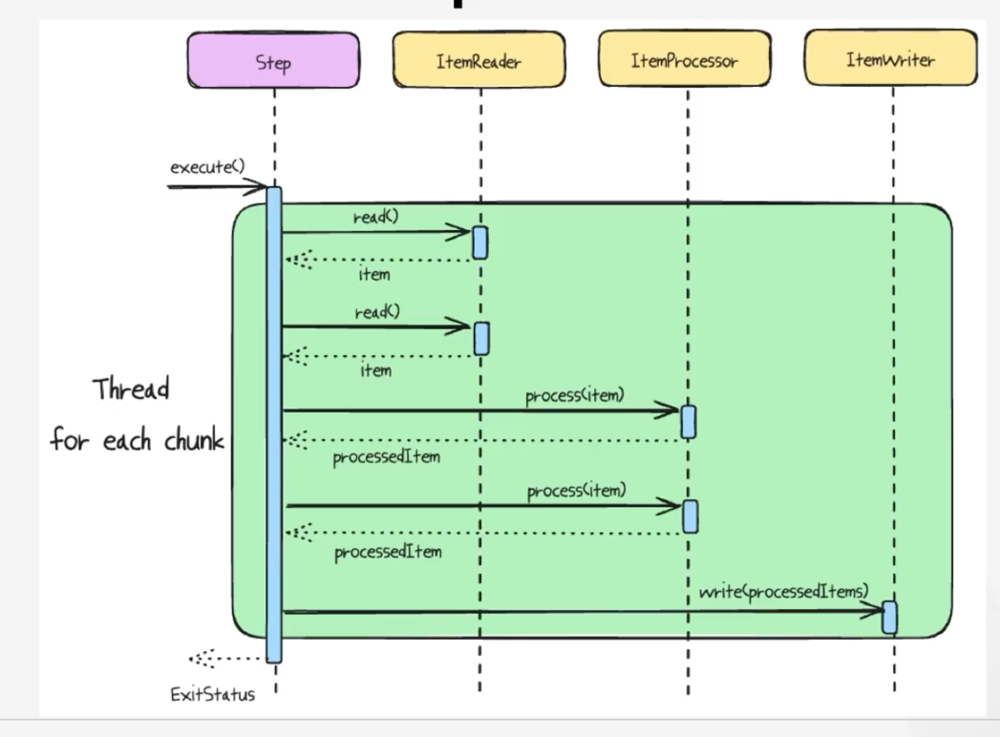
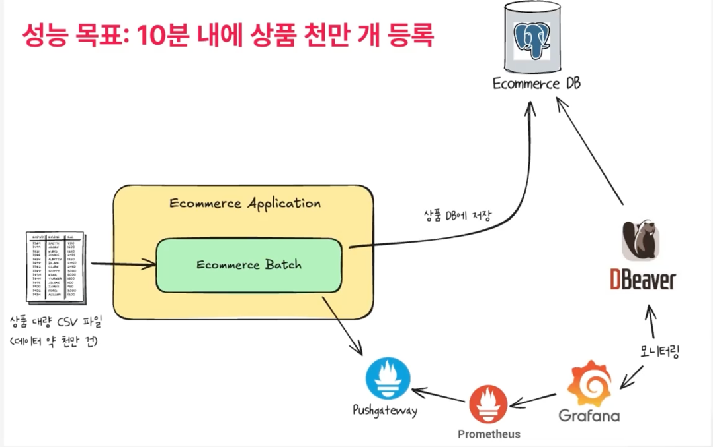

```java
  @Bean
  public TaskExecutor taskExecutor() {
    ThreadPoolTaskExecutor executor = new ThreadPoolTaskExecutor();
    executor.setWaitForTasksToCompleteOnShutdown(true);
    executor.setAwaitTerminationSeconds(10);
    return executor;
  }
```
setCorePoolSize(128)

setQueueCapacity(128)

setAllowCoreThreadTimeOut(true)

setWaitForTasksToCompleteOnShutdown(true)

멀티 스레드 환경에서 동기화된 읽기를 보장하기 위해 사용됩니다.
```
@Bean
  @StepScope
  public SynchronizedItemStreamReader<ProductUploadCsvRow> productReader(
      @Value("#{jobParameters['inputFilePath']}") String path // 프로그램 변수로 주어짐 configuration 편집에 있음
  ) {
    FlatFileItemReader<ProductUploadCsvRow> productReader = new FlatFileItemReaderBuilder<ProductUploadCsvRow>()
            .name("productReader")
            .resource(new FileSystemResource(path))
            .delimited()
            .names(ReflectionUtils.getFieldNames(ProductUploadCsvRow.class).toArray(String[]::new))
            .targetType(ProductUploadCsvRow.class)
            .linesToSkip(1)
            .build();
    return new SynchronizedItemStreamReaderBuilder<ProductUploadCsvRow>()
            .delegate(productReader)
            .build();
  }
```
스레드 세이프하게 파일에서 데이터를 읽어오기 때문에, 스레드 세이프 하지 않은 경우보다는 더 느립니다.  
그 이유는 스레드에 락이 걸리기 때문입니다.

Job이 전부 실행되지 않은 상태에서 중지하면, DB에 job Log가 남습니다.