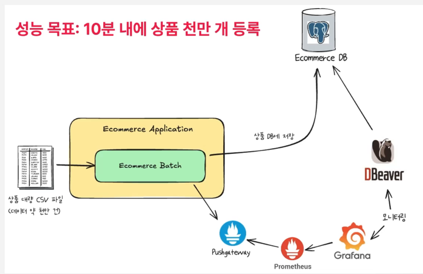

### 병렬 처리
멀티 스레드를 활용한 병렬 처리는 청크단위로 쓰레드를 할당하여 각 스레드가 이 청크에 대해서 아이템들을 리드하고 프로세스하고 라이트까지 하는 것을 말합니다.  




스레드를 사용하기 위해서 스레드를 가져올 수 있는 방법을 정의해야 합니다.  

```java
  @Bean
  public TaskExecutor taskExecutor() {
    ThreadPoolTaskExecutor executor = new ThreadPoolTaskExecutor();
    executor.setCorePoolSize(128);
    executor.setQueueCapacity(128);
    executor.setAllowCoreThreadTimeOut(true);
    executor.setWaitForTasksToCompleteOnShutdown(true);
    executor.setAwaitTerminationSeconds(10);
    return executor;
  }
```
setCorePoolSize(128)

코어 스레드 풀 크기를 128로 설정.
최소한 유지되는 스레드 개수를 의미함.
스레드 풀 내에서 최소한 128개의 스레드가 유지되며, 작업이 없더라도 종료되지 않음.
만약 setAllowCoreThreadTimeOut(true)를 설정하면, 사용되지 않는 코어 스레드도 종료될 수 있음.
setQueueCapacity(128)

작업 대기 큐의 크기를 128로 설정.
코어 스레드 개수(128개)를 모두 사용 중이라면, 추가 작업은 이 대기 큐에 들어감.
대기 큐도 가득 차면, 새로운 스레드가 생성될 수 있음. (단, maximumPoolSize가 설정되어 있어야 함)
큐가 가득 찬 상태에서 더 이상 생성할 스레드가 없으면, 작업을 거부할 수도 있음.
setAllowCoreThreadTimeOut(true)

true이면, 코어 스레드도 일정 시간이 지나면 종료될 수 있음.
기본적으로는 코어 스레드는 영구적으로 유지되지만, 이 설정을 true로 하면 비활성화된 코어 스레드도 제거됨.
리소스 절약을 위해 유휴 스레드를 줄일 수 있음.
setWaitForTasksToCompleteOnShutdown(true)

true로 설정하면, 애플리케이션이 종료될 때 실행 중이던 작업을 마칠 때까지 기다림.
예를 들어, 서버가 종료되더라도 아직 처리 중인 작업이 있으면, 그 작업이 완료될 때까지 기다림.
설정하지 않으면, 서버 종료 시 작업이 강제 중단될 수 있음.
setAwaitTerminationSeconds(10)

애플리케이션 종료 시, 남은 작업을 기다리는 최대 시간(초 단위)을 설정.
위의 setWaitForTasksToCompleteOnShutdown(true)와 함께 사용됨.
10초 동안 대기한 후에도 작업이 끝나지 않으면, 강제 종료될 수 있음.


### 적용 방법
Step에다가 taskExecutor를 적용해 줍니다.  


1000만개 데이터를 넣는데 3분 47초가 걸립니다.  

docker 환경에서는 localhost가 아닌 docker 내부의 컨테이너 명으로 url을 연결해주어야 합니다.  
