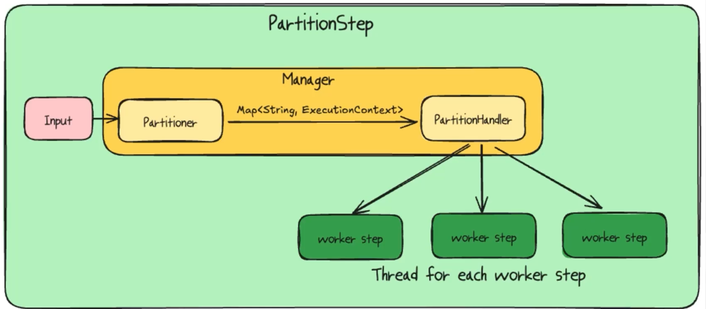
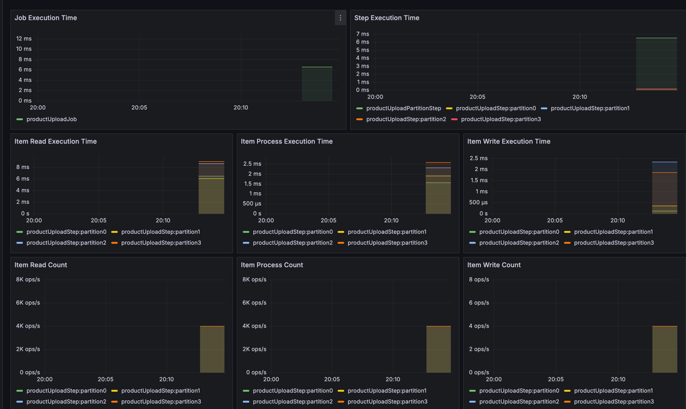

## 파티셔닝 

작업 자체를 여러개로 먼저 쪼개줍니다.  


파일 하나를 스레드 세이프하게 읽어서 병목이 발생합니다.  
애초에 파일 하나를 여러로 나눠서 각 파일을 각 스레드에서 처리하면 병목 현상이 줄어들기 때문에 
파일 쪼개는 것을 파티셔닝을 통해서 진행을 해줍니다.  

그라파나로 조금 더 실시간으로 데이터 진행을 보기 위해서,
청크 리스너를 사용합니다. 

각 청크가 끝날때마다 모니터로 push를 해줍니다.  
아래 코드는 파티셔닝이 적용된 Batch 처리를 하는 코드입니다.  
```java
package org.example.batch.jobconfig.product.upload;

import javax.sql.DataSource;
import org.example.batch.domain.product.Product;
import org.example.batch.dto.ProductUploadCsvRow;
import org.example.batch.service.file.SplitFilterPartitioner;
import org.example.batch.util.FileUtils;
import org.example.batch.util.ReflectionUtils;
import org.springframework.batch.core.Job;
import org.springframework.batch.core.JobExecutionListener;
import org.springframework.batch.core.Step;
import org.springframework.batch.core.StepExecutionListener;
import org.springframework.batch.core.configuration.annotation.JobScope;
import org.springframework.batch.core.configuration.annotation.StepScope;
import org.springframework.batch.core.job.builder.JobBuilder;
import org.springframework.batch.core.partition.PartitionHandler;
import org.springframework.batch.core.partition.support.TaskExecutorPartitionHandler;
import org.springframework.batch.core.repository.JobRepository;
import org.springframework.batch.core.step.builder.StepBuilder;
import org.springframework.batch.item.ItemProcessor;
import org.springframework.batch.item.ItemReader;
import org.springframework.batch.item.ItemWriter;
import org.springframework.batch.item.database.JdbcBatchItemWriter;
import org.springframework.batch.item.database.builder.JdbcBatchItemWriterBuilder;
import org.springframework.batch.item.file.FlatFileItemReader;
import org.springframework.batch.item.file.builder.FlatFileItemReaderBuilder;
import org.springframework.batch.item.support.SynchronizedItemStreamReader;
import org.springframework.batch.item.support.builder.SynchronizedItemStreamReaderBuilder;
import org.springframework.beans.factory.annotation.Qualifier;
import org.springframework.beans.factory.annotation.Value;
import org.springframework.context.annotation.Bean;
import org.springframework.context.annotation.Configuration;
import org.springframework.core.io.FileSystemResource;
import org.springframework.core.task.TaskExecutor;
import org.springframework.transaction.PlatformTransactionManager;

import java.io.File;

@Configuration
public class ProductUploadJobConfiguration {

  @Bean
  public Job productUploadJob(JobRepository jobRepository,
      Step productUploadPartitionStep,
      JobExecutionListener listener) {
    return new JobBuilder("productUploadJob", jobRepository)
        .listener(listener)
        .start(productUploadPartitionStep)
        .build();
  }

  @Bean
  public Step productUploadPartitionStep(
          JobRepository jobRepository,
          Step productUploadStep,
          SplitFilterPartitioner splitFilterPartitioner,
          PartitionHandler filePathHandler
          ) {
    return new StepBuilder("productUploadPartitionStep", jobRepository)
            .partitioner(productUploadStep.getName(), splitFilterPartitioner)
            .partitionHandler(filePathHandler)
            .allowStartIfComplete(true)
            .build();
  }

  @Bean
  @JobScope
  public SplitFilterPartitioner splitFilterPartitioner(
          @Value("#{jobParameters['inputFilePath']}") String path,
          @Value("#{jobParameters['gridSize']}") int gridSize
  ) {
    return new SplitFilterPartitioner(FileUtils.splitCsv(new File(path), gridSize));
  }

  @Bean
  public TaskExecutorPartitionHandler filePathHandler(
          TaskExecutor taskExecutor,
          Step productUploadStep,
          @Value("#{jobParameters['gridSize']}") int gridSize
          ) {
    TaskExecutorPartitionHandler handler = new TaskExecutorPartitionHandler();
    handler.setTaskExecutor(taskExecutor);
    handler.setStep(productUploadStep);
    handler.setGridSize(gridSize);
    return handler;
  }

  @Bean
  public Step productUploadStep(JobRepository jobRepository,
                                PlatformTransactionManager transactionManager,
                                StepExecutionListener stepExecutionListener,
                                ItemReader<ProductUploadCsvRow> productReader,
                                ItemProcessor<ProductUploadCsvRow, Product> productProcessor,
                                ItemWriter<Product> productWriter,
                                @Qualifier("taskExecutor") TaskExecutor taskExecutor) {
    return new StepBuilder("productUploadStep", jobRepository)
        .<ProductUploadCsvRow, Product>chunk(1000, transactionManager)
        .reader(productReader)
        .processor(productProcessor)
        .writer(productWriter)
        .allowStartIfComplete(true) // 개발 단계에서는 true를 넣어서 돌립니다.
        .listener(stepExecutionListener)
            .taskExecutor(taskExecutor)
        .build();
  }

  // csv파일 읽기
  @Bean
  @StepScope
  public SynchronizedItemStreamReader<ProductUploadCsvRow> productReader(
      @Value("#{stepExecutionContext['inputFilePath']}") File file // 프로그램 변수로 주어짐 configuration 편집에 있음
  ) {
    FlatFileItemReader<ProductUploadCsvRow> productReader = new FlatFileItemReaderBuilder<ProductUploadCsvRow>()
            .name("productReader")
            .resource(new FileSystemResource(file))
            .delimited()
            .names(ReflectionUtils.getFieldNames(ProductUploadCsvRow.class).toArray(String[]::new))
            .targetType(ProductUploadCsvRow.class)
            .linesToSkip(1)
            .build();
    return new SynchronizedItemStreamReaderBuilder<ProductUploadCsvRow>()
            .delegate(productReader)
            .build();
  }

  // productUploadCsvRow -> Product로 매핑
  @Bean
  public ItemProcessor<ProductUploadCsvRow, Product> productProcessor() {
    return row -> Product.from(row);
  }

  @Bean
  public JdbcBatchItemWriter<Product> productWriter(DataSource dataSource) {

    String sql = "insert into products(product_id, seller_id, category, product_name, "
        + "sales_start_date, sales_end_date, product_status, "
        + "brand, manufacturer, sales_price, stock_quantity, created_at, updated_at)"
        + " values(:productId, :sellerId, :category, :productName, :salesStartDate, "
        + ":salesEndDate, :productStatus, :brand, :manufacturer, :salesPrice, "
        + ":stockQuantity, :createdAt, :updatedAt)";

    return new JdbcBatchItemWriterBuilder<Product>()
        .dataSource(dataSource)
        .sql(sql)
        .beanMapped()
        .build();
  }
}

```

✅ @ExtendWith(SpringExtension.class)를 사용하면 Spring 컨텍스트를 테스트 환경에서 활성화할 수 있습니다.  
@ExtendWith(SpringExtension.class)가 필요한 이유
Spring에서 @Value, @Autowired 같은 어노테이션은 Spring 컨텍스트에 의해 관리되는 빈(Bean)에서만 동작합니다.
그러나 JUnit5 (JUnit Jupiter) 테스트 클래스는 기본적으로 Spring이 관리하는 빈이 아니기 때문에, @ExtendWith(SpringExtension.class)를 사용하여 Spring의 기능을 활성화해야 합니다.

파일은 나누는 유틸을 만들어줍니다.  
```java
package org.example.batch.util;

import java.io.*;
import java.nio.charset.StandardCharsets;
import java.nio.file.Files;
import java.util.ArrayList;
import java.util.List;
import java.util.stream.Stream;

public class FileUtils {

    public static List<File> splitCsv(File csvFile, int fileCount){

        // csv파일의 row수를 읽어서, 파일을 나눠줍니다.
        long lineCount = 0L; // 파일의 라인 수

        try(Stream<String> stream = Files.lines(csvFile.toPath(), StandardCharsets.UTF_8)) {
            lineCount = stream.count(); // 라인 카운트
            long linesPerFile = (long) Math.ceil((double) lineCount / fileCount); // 5 / 2-> ceil(5/2) -> 3 / 2로 2개가 됩니다.

            // 파일을 쪼개기 위해선 파일들을 여러개 만들어야 한다.
            return splitFiles(csvFile, linesPerFile);
        } catch (IOException e) {
            throw new RuntimeException(e);
        }
    }

    private static List<File> splitFiles(File csvFile, long linesPerFile) throws IOException {
        List<File> splitFiles = new ArrayList<>();
        try(BufferedReader reader = new BufferedReader(new FileReader(csvFile))) {
            String line = "";
            boolean firstLine = true;
            BufferedWriter writer = null;
            int lineCount = 0;
            boolean shouldCreateFile = true;
            File splitFile;
            int fileIndex = 0;
            while((line = reader.readLine()) != null) {
                if(firstLine) {
                    firstLine = false;
                    continue;
                }
                if(shouldCreateFile) {
                    splitFile = createTempFile("split_" + (fileIndex++) + "_",".csv");
                    writer = new BufferedWriter(new FileWriter(splitFile));
                    splitFiles.add(splitFile);
                    lineCount = 0;
                    shouldCreateFile = false;
                }
                writer.write(line); // 파일 쓰기
                writer.newLine( );
                lineCount++;

                if(lineCount >= linesPerFile) {
                    writer.close();
                    shouldCreateFile = true;
                }
            }

            writer.close();
        }
        return splitFiles;
    }

    private static File createTempFile(String prefix, String suffix) throws IOException {
        File tempFile = File.createTempFile(prefix, suffix);
        tempFile.deleteOnExit(); // 파일이 종료되면 JVM 종료시 삭제됩니다.
        return tempFile;
    }
}
```

파티션을 나눠주면 아래와 같이 됩니다.  
